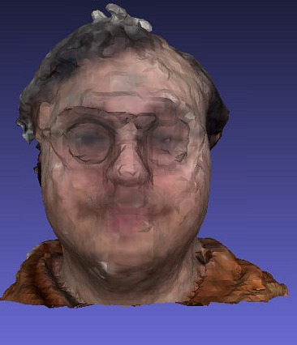
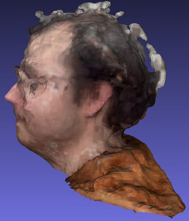
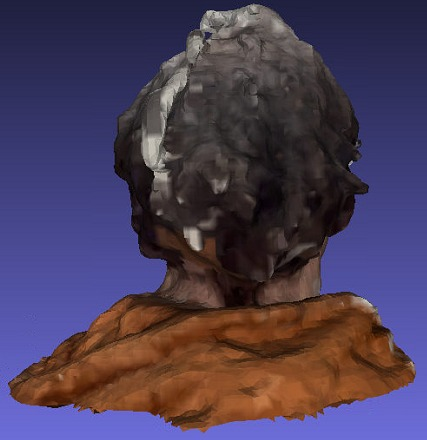

# 3D Head Reconstruction Pipeline

A hybrid classical/neural pipeline that reconstructs a watertight 3D head mesh from a set of RGB images. Runs fully offline on a single consumer GPU in under 5 minutes.

## Approach

The pipeline combines MODNet (PyTorch) for foreground segmentation with COLMAP for camera pose estimation and dense multi-view stereo. The resulting point cloud is processed through Poisson Surface Reconstruction to generate a closed mesh. A geometry-based post-processing stage automatically detects the shoulder boundary, caps the open base, fills remaining holes, and decimates to the target face count. The final mesh is exported with vertex normals and corrected orientation.

## Quick Start

\`\`\`bash
python run.py --input ./images --output mesh.ply
\`\`\`

## Setup

### 1. System dependencies

\`\`\`bash
sudo apt install colmap
\`\`\`

### 2. Python environment

\`\`\`bash
conda env create -f environment.yml
conda activate head_3d_reconstruction
\`\`\`

### 3. MODNet weights

\`\`\`bash
pip install gdown
gdown 1Nf1ZxeJZJL8Qx9KadcYYyEmmlKhTADxX -O modnet.ckpt
\`\`\`

### 4. MODNet source

\`\`\`bash
git clone https://github.com/ZHKKKe/MODNet modnet_src
\`\`\`

## Arguments

| Argument | Default | Description |
|---|---|---|
| --input | required | Directory of input images |
| --output | required | Output path (.obj or .ply) |
| --quality | medium | Reconstruction quality: low, medium, high |
| --max-faces | 50000 | Max faces after decimation |
| --no-gpu | false | Disable GPU |
| --weights | ./modnet.ckpt | Path to MODNet weights |
| --work-dir | ./workdir | Intermediate files directory |

## Benchmarks

Measured on RTX 3080 with 100 input frames:

| Stage | Time |
|---|---|
| Preprocessing | ~0.2s |
| Masking (MODNet) | ~2.5s |
| SfM (COLMAP) | ~15s |
| Dense MVS (COLMAP) | ~155s |
| Poisson meshing | ~13s |
| Post-processing | ~0.5s |
| Total | ~186s |

Estimated on RTX 3060: ~260s (~4.3 minutes).

## Output

A .ply or .obj file with up to 50K triangular faces, vertex normals, vertex colors, corrected orientation (Y-up, face-forward), and near-watertight topology.

## Pipeline

| Stage | Module | Description |
|---|---|---|
| Preprocessing | pipeline/preprocessing.py | RGBA to RGB conversion |
| Masking | pipeline/masking.py | MODNet foreground segmentation |
| SfM | pipeline/sfm.py | COLMAP sparse reconstruction |
| Dense | pipeline/dense.py | COLMAP patch-match stereo and fusion |
| Meshing | pipeline/meshing.py | Poisson surface reconstruction |
| Post-processing | pipeline/postprocess.py | Shoulder detection, capping, decimation, export |

## Capture guidelines

Best results come from 360 degree coverage at consistent lighting with the subject against a plain background. The pipeline accepts up to 200 images and automatically subsamples to 100 frames to stay within the 5-minute runtime budget on an RTX 3060.
